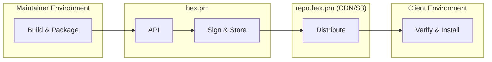

# Supply Chain Security Overview

This document describes the supply chain security approach for the Hex ecosystem.

## What is Supply Chain Security?

Supply chain security ensures that:

1. **Provenance** - You know where software came from
2. **Integrity** - Software hasn't been tampered with
3. **Verification** - Claims can be cryptographically verified

## Hex Supply Chain Model

## Security Properties

### Publishing Side

| Property | Description | Status |
|----------|-------------|--------|
| Authentication | Publishing requires authenticated user | Implemented |
| Authorization | Only owners can publish to their packages | Implemented |
| Audit logging | All publishing actions are logged | Implemented |
| Owner notifications | All package owners are notified by email when a new version is published or when owners are added or removed | Implemented |
| 2FA for publishing | OTP required for write operations via OAuth | Implemented |
| Trusted publishing (OIDC) | Short-lived CI credentials | Planned |
| Build provenance (SLSA) | Cryptographic proof of build origin | Planned |

### Distribution Side

| Property | Description | Status |
|----------|-------------|--------|
| Signed registry | Metadata signed with RSA-SHA512 | Implemented |
| Checksums | Artifacts have SHA-256 checksums | Implemented |
| Immutability | Versions cannot be modified after grace period | Implemented |
| Transparency log | Append-only log of publication events | Planned |

### Consumption Side

| Property | Description | Status |
|----------|-------------|--------|
| Signature verification | Clients verify registry signatures | Implemented |
| Checksum verification | Clients verify artifact checksums | Implemented |
| Lock files | Exact versions recorded for reproducibility | Implemented |
| Provenance verification | Clients verify build attestations | Planned |

## Attack Surface

| Stage | Threats | Current Mitigations |
|-------|---------|---------------------|
| Maintainer | Compromised credentials, malicious insider | 2FA, OAuth, audit logs |
| Build | Compromised build environment | None (planned: trusted publishing, SLSA provenance) |
| Publishing | Unauthorized publish, tampering | Authentication, authorization |
| Distribution | CDN/mirror tampering, MITM | Signed registry, checksums |
| Consumption | Dependency confusion, typosquatting | Repository field verification, typosquatting detection |

## Detailed Documentation

- [Provenance](./provenance.md) - Build origin and attestations
- [Signing](./signing.md) - Registry signing and checksums
- [Verification](./verification.md) - Client-side verification

## Related Specifications

- [Client Flows](../threat-model/client-flows.md) - Detailed client interaction flows
- [Registry v2](../../registry-v2.md) - Signed registry format
- [Package Tarball](../../package_tarball.md) - Checksum format

