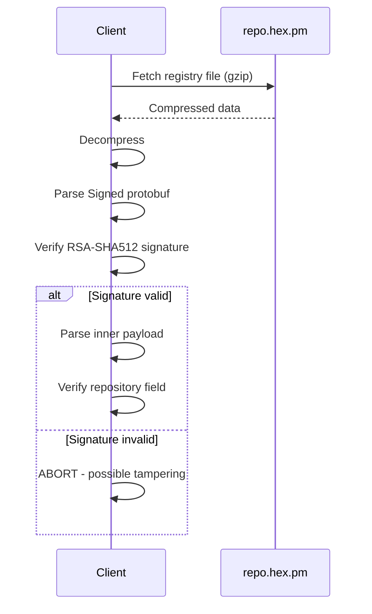
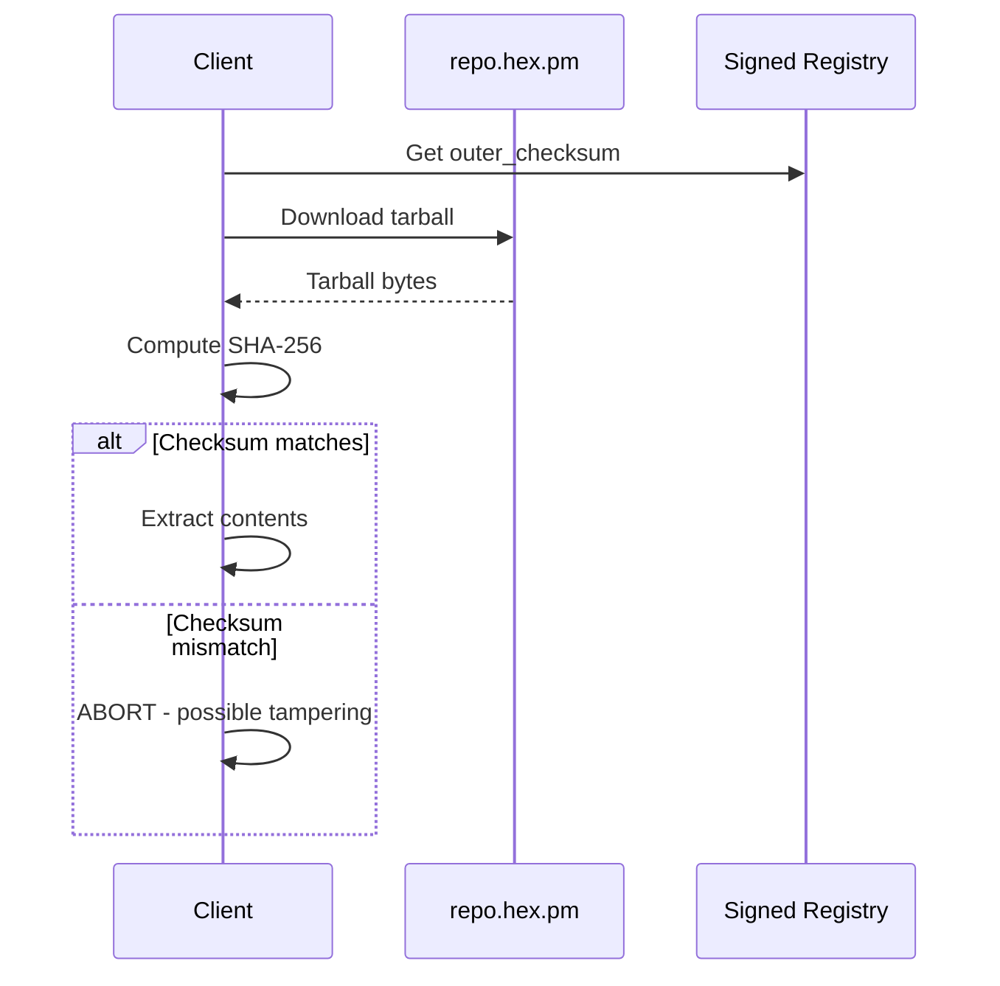

# Signing

This document describes cryptographic signing in the Hex ecosystem.

## Registry Signing

### What is Signed

All registry files are signed:

| File | Description |
|------|-------------|
| `/names` | List of package names |
| `/versions` | All package versions |
| `/packages/{name}` | Per-package metadata |

### Signature Format

Registry files use a [`Signed` protobuf wrapper](../../registry/signed.proto).
See [Registry v2](../../registry-v2.md) for full specification.

### Algorithm

| Parameter | Value |
|-----------|-------|
| Signature algorithm | RSA-PKCS1-SHA512 |
| Key size | 2048 bits |
| Payload | Raw protobuf bytes (before signing) |

### Public Key Distribution

The hex.pm public key is:

- Hardcoded in official client libraries
- Available at https://hex.pm/docs/public_keys
- Should be verified out-of-band

### Verification Process

See [Client Flows](../threat-model/client-flows.md#registry-verification) for
detailed verification steps.

## Package Checksums

### Outer Checksum

| Attribute | Value |
|-----------|-------|
| Algorithm | SHA-256 |
| Input | Entire tarball file |
| Storage | In signed registry metadata |
| Verification | Before trusting tarball contents |

### Inner Checksum (Legacy)

| Attribute | Value |
|-----------|-------|
| Algorithm | SHA-256 |
| Input | Concatenation of VERSION, metadata.config, contents.tar.gz |
| Storage | CHECKSUM file inside tarball |
| Status | Legacy - outer checksum is authoritative |

See [Package Tarball](../../package_tarball.md) for format details.

### Verification Process

## Trust Model

### What Signing Provides

| Property | Description |
|----------|-------------|
| Integrity | Detect tampering with registry/artifacts |
| Authenticity | Confirm data came from hex.pm |
| Freshness | Combined with caching headers |

### What Signing Does NOT Provide

| Property | Reason |
|----------|--------|
| Provenance | No proof of who built the package |
| Safety | No guarantee package is safe to use |
| Source verification | No link to source code |

> [!CAUTION]
> A valid signature only proves the artifact came from hex.pm. It does NOT prove
> the package is safe, trustworthy, or built from the claimed source.

## Key Management

### Current State

| Aspect | Status |
|--------|--------|
| Key count | Single signing key for all registry files |
| Protection | Infrastructure security controls |
| Rotation | Never performed; highly disruptive (breaks all clients until updated) |
| Transparency | Key changes are implicitly visible |

### Planned Improvements

| Feature | Description | Status |
|---------|-------------|--------|
| Chain of trust | Offline root key signs operational signing keys | Future |

## Future: Attestation Signing

Beyond registry signing, future attestations (SLSA provenance, VEX, etc.) will use:

| Technology | Purpose |
|------------|---------|
| Sigstore/Fulcio | Keyless signing with OIDC identity |
| Sigstore/Rekor | Transparency log for attestations |
| SCITT | Enterprise transparency receipts |
| DSSE | Multi-signature envelope format |

See [Provenance](./provenance.md) for details on planned attestation support.

## Related Documentation

- [Verification](./verification.md) - Client-side verification
- [Registry v2](../../registry-v2.md) - Registry format specification
- [Client Flows](../threat-model/client-flows.md) - Detailed verification flows
