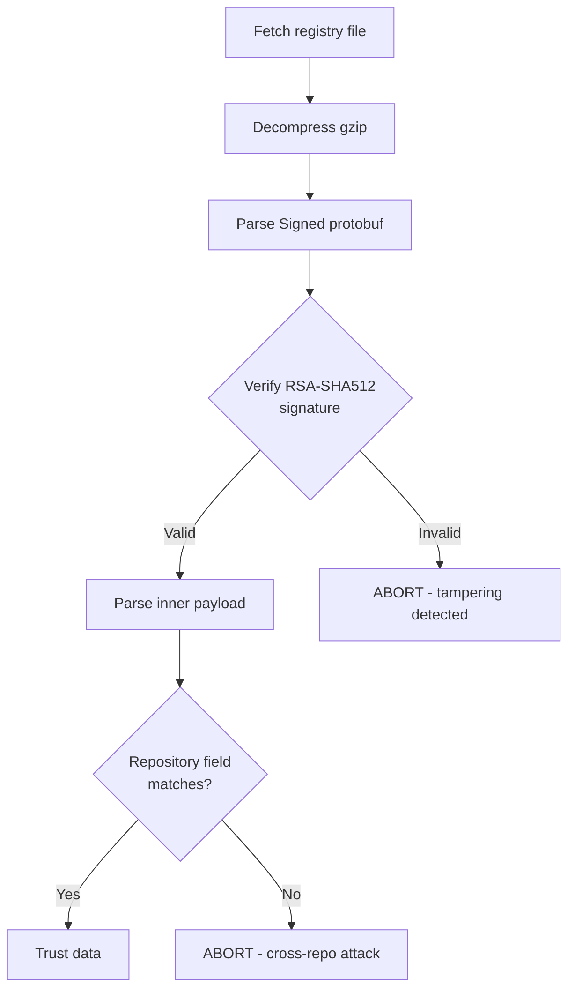
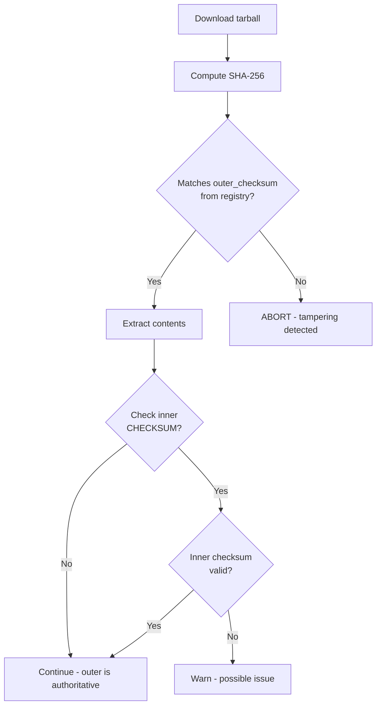
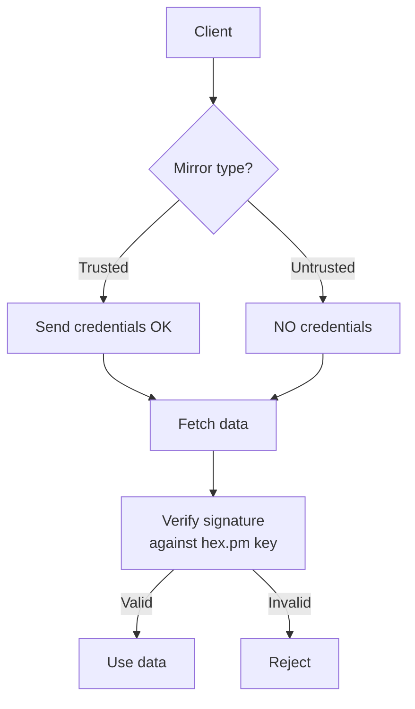

# Verification

This document describes client-side verification in the Hex ecosystem.

## Overview

Clients MUST verify integrity before trusting registry data or package contents.

See [Client Flows](../threat-model/client-flows.md#verification-summary) for the authoritative specification.

## Registry Verification

All clients perform these steps:

### Verification Steps

| Step | Action | Failure Behavior |
|------|--------|------------------|
| 1. Decompress | Decompress gzip-compressed registry file | Error |
| 2. Decode | Parse outer `Signed` protobuf | Error |
| 3. Verify signature | RSA-PKCS1-SHA512 against hex.pm public key | **ABORT** |
| 4. Verify repository | Check `repository` field matches expected | **ABORT** |
| 5. Parse payload | Parse inner protobuf (Names, Versions, Package) | Error |

> [!IMPORTANT]
> Steps 3 and 4 are security-critical. Failure at these steps indicates possible tampering or cross-repository attacks.

### Signature Verification Detail

## Tarball Verification

### Verification Steps

| Step | Action | Failure Behavior |
|------|--------|------------------|
| 1. Download | Fetch from `/tarballs/{name}-{version}.tar` | Retry/error |
| 2. Compute checksum | SHA-256 of entire tarball | Error |
| 3. Compare | Check against `outer_checksum` from signed registry | **ABORT** |
| 4. Extract | Extract: VERSION, metadata.config, contents.tar.gz, CHECKSUM | Error |
| 5. Inner checksum | Verify CHECKSUM file (optional, legacy) | Warning |

### Checksum Verification Detail

## Client Implementations

| Client | Library | Language |
|--------|---------|----------|
| Mix (Elixir) | hex_core | Erlang |
| Rebar3 (Erlang) | hex_core | Erlang |
| Gleam | hexpm-rust | Rust |

### Verification Code Locations

| Client | Verification Module | Notes |
|--------|---------------------|-------|
| hex_core | `hex_repo` | Shared by Mix and Rebar3 |
| hexpm-rust | `hexpm::repo` | Uses `ring` crate for crypto |

## Error Handling

### Signature Failure

| Response | Action |
|----------|--------|
| Abort | Stop immediately |
| Message | Security error - possible tampering |
| Fallback | **NEVER** fall back to unverified data |

### Checksum Mismatch

| Response | Action |
|----------|--------|
| Abort | Stop immediately |
| Message | Integrity error - possible tampering |
| Fallback | **NEVER** use mismatched artifact |

### Network Failure

| Response | Action |
|----------|--------|
| Retry | Attempt retry with backoff |
| Cache | May fall back to cached data (with warning) |
| Reason | Cached data was verified when fetched |

## Mirror Security

### Trusted vs Untrusted Mirrors

| Mirror Type | Credentials | Use Case |
|-------------|-------------|----------|
| Trusted | Can receive credentials | Organization-controlled mirrors |
| Untrusted | **NEVER** send credentials | Community mirrors, public caches |

### Untrusted Mirror Security

> [!CAUTION]
> When using untrusted mirrors:
> - **NEVER** send credentials (API keys, tokens)
> - **ALWAYS** verify signatures (signatures are from hex.pm, not mirror)
> - Private packages MUST use trusted endpoints only

## Public Key

### Current Key

| Attribute | Value |
|-----------|-------|
| Algorithm | RSA |
| Key size | 2048 bits |
| Usage | RSA-PKCS1-SHA512 signatures |
| Distribution | Hardcoded in clients |
| Availability | https://hex.pm/docs/public_keys |

### Key Pinning

> [!TIP]
> For high-security environments, verify the public key out-of-band before first use. Compare the key in your client library against the key published at hex.pm.

## Future: Attestation Verification

Planned verification capabilities for SLSA provenance and other attestations:

| Feature | Description | Status |
|---------|-------------|--------|
| SLSA provenance | Verify build attestations | Planned |
| VEX verification | Verify vulnerability statements | Planned |
| Transparency proofs | Verify inclusion in transparency log | Planned |
| Policy enforcement | Require minimum provenance level | Planned |

## Related Documentation

- [Signing](./signing.md) - How signing works
- [Client Flows](../threat-model/client-flows.md) - Detailed client flows
- [Provenance](./provenance.md) - Build provenance and attestations
