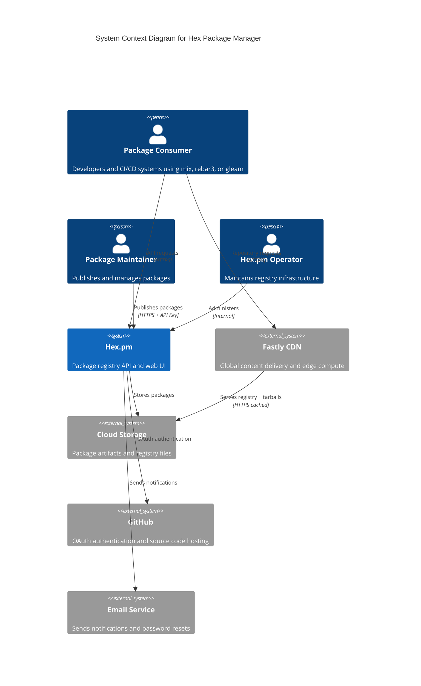
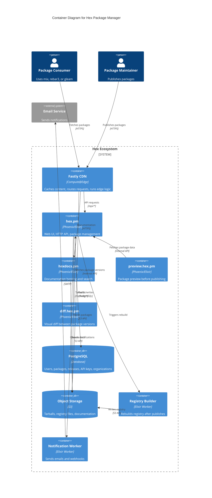
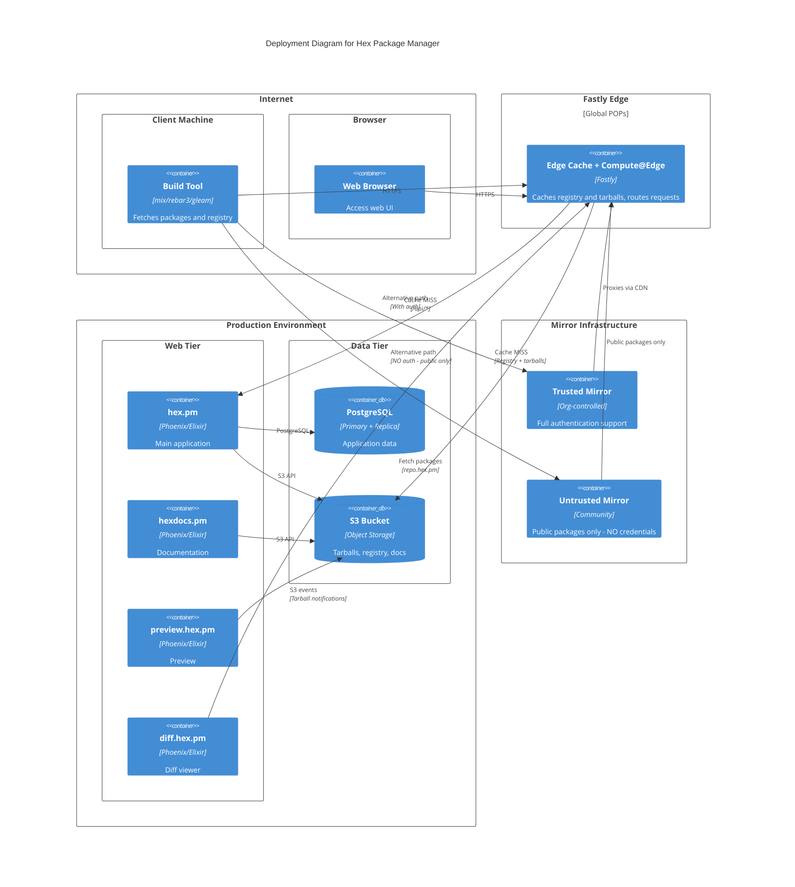
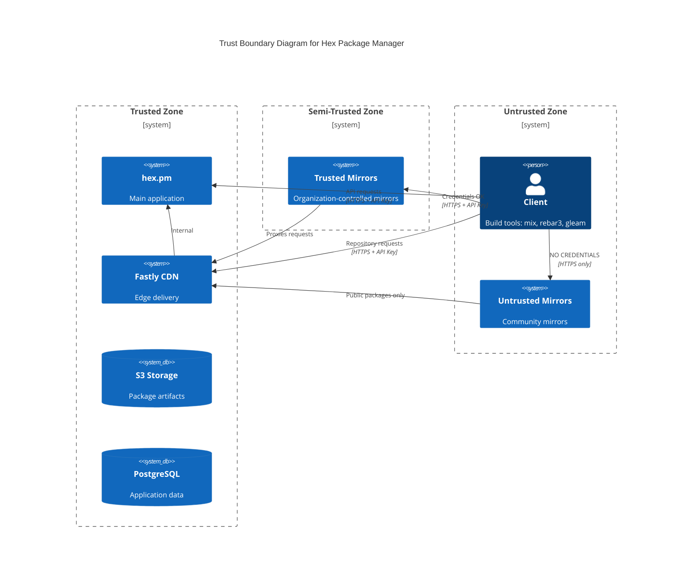
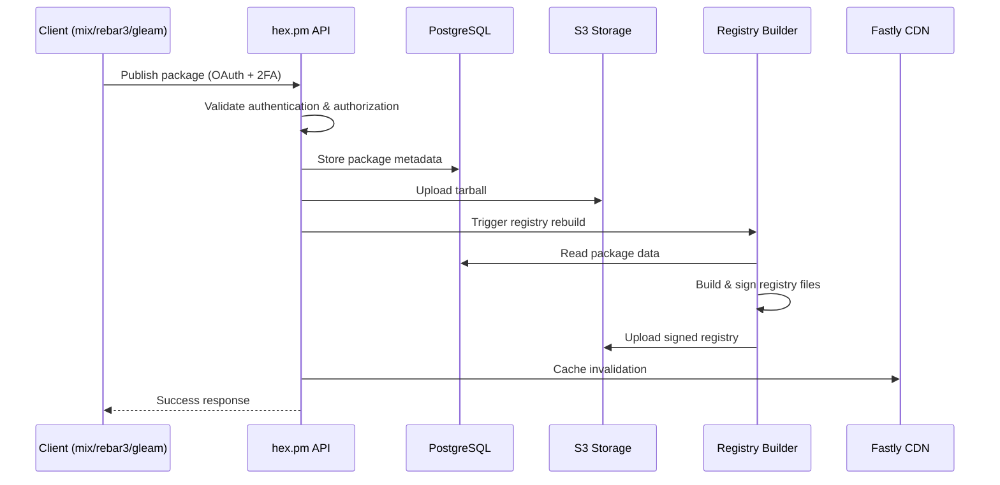
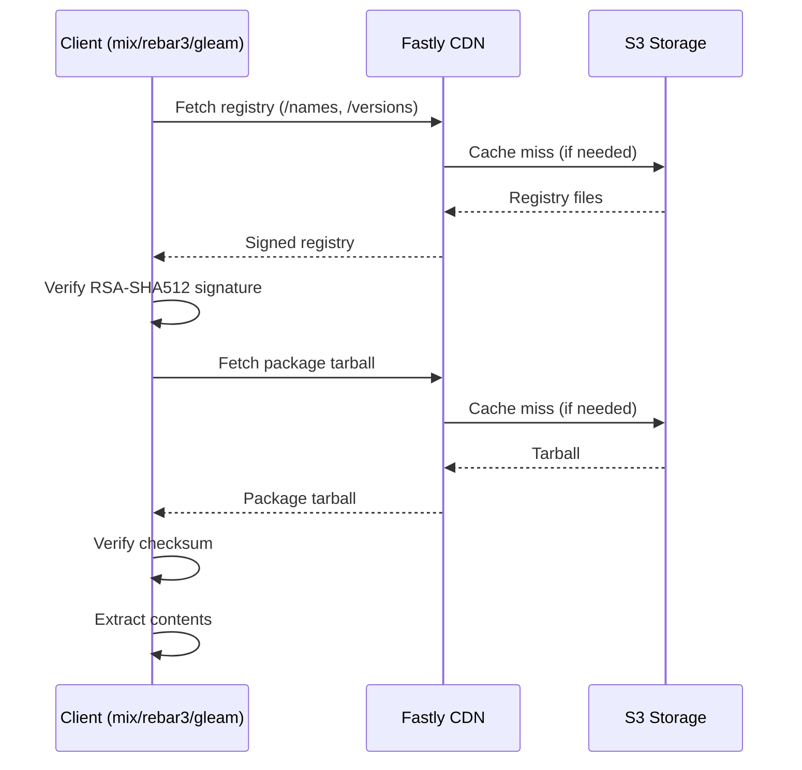

# Architecture

This document describes the system architecture from a security perspective. For detailed client interaction flows including authentication, verification, and caching, see [Client Flows](client-flows.md).

## Ecosystem Inventory

### Services

| Name | Description | Production | Staging | Repository |
|------|-------------|------------|---------|------------|
| Hex Registry | Main registry, web UI & API | hex.pm | staging.hex.pm | [hexpm/hexpm](https://github.com/hexpm/hexpm) |
| Hex Operations | Terraform, Config, Fastly Compute | - | - | [hexpm/hexpm-ops](https://github.com/hexpm/hexpm-ops) (private) |
| Hex Docs | Documentation hosting | hexdocs.pm | staging.hexdocs.pm | [hexpm/hexdocs](https://github.com/hexpm/hexdocs), [hexpm/hexdocs-search](https://github.com/hexpm/hexdocs-search) |
| Hex Preview | Package preview | preview.hex.pm | preview.staging.hex.pm | [hexpm/preview](https://github.com/hexpm/preview) |
| Hex Diff | Package diff viewer | diff.hex.pm | diff.staging.hex.pm | [hexpm/diff](https://github.com/hexpm/diff) |

> **Out of scope:** billing.hex.pm is excluded from this security documentation.

### Client Libraries

| Name | Description | Repository |
|------|-------------|------------|
| Hex | Elixir Hex client | [hexpm/hex](https://github.com/hexpm/hex) |
| Hex Core | Core library for Elixir/Erlang clients | [hexpm/hex_core](https://github.com/hexpm/hex_core) |
| Hex Solver | Version constraint resolver | [hexpm/hex_solver](https://github.com/hexpm/hex_solver) |
| hexpm-rust | Rust Hex client (used by Gleam) | [gleam-lang/hexpm-rust](https://github.com/gleam-lang/hexpm-rust) |

### Build Tools

| Name | Description | Repository |
|------|-------------|------------|
| Mix | Elixir build tool | [elixir-lang/elixir](https://github.com/elixir-lang/elixir) (lib/mix) |
| Rebar3 | Erlang build tool | [erlang/rebar3](https://github.com/erlang/rebar3) |
| erlang.mk | Erlang build tool | [ninenines/erlang.mk](https://github.com/ninenines/erlang.mk) |
| Gleam | Gleam language & build tool | [gleam-lang/gleam](https://github.com/gleam-lang/gleam) |

## System Context

Shows the Hex ecosystem and its relationships with users and external systems.

**Actors** (see [Actors](actors.md) for details):
- **Package Consumers** - Developers and CI/CD systems that fetch packages
- **Package Maintainers** - Publish and manage packages via the web UI or CLI
- **Organization Administrators** - Manage private repositories and teams
- **Hex.pm Operators** - Maintain and operate the registry infrastructure

**External Systems:**
- **GitHub** provides OAuth authentication and hosts package source code
- **Email Service** sends password resets, ownership notifications, etc.
- **Fastly CDN** caches and delivers registry files and package tarballs globally

## Container Diagram

Shows the internal services and data stores within the Hex ecosystem.

## Deployment Diagram

Shows the production infrastructure deployment topology.

### Deployment Security Notes

- **CDN Strategy**: All traffic flows through Fastly; registry files and tarballs are heavily cached
- **Mirror Trust**: Trusted mirrors can proxy authenticated requests; untrusted mirrors only serve public packages
- **High Availability**: S3 provides artifact durability; Fastly provides global redundancy

## Key Components

| Component | Description | Security Role |
|-----------|-------------|---------------|
| hex.pm API | Package registry API | Authentication, authorization, publishing |
| hex.pm Web | Web interface | User management, 2FA, session handling |
| Fastly CDN + S3 | Content delivery and storage | Artifact integrity, signed registry |
| hexdocs.pm | Documentation hosting | Content isolation, XSS prevention |
| Hex clients | Build tool integrations (mix, rebar3, gleam) | Signature verification, checksum validation |
| Registry Builder | Background worker | Signs registry files after publish |
| Notification Worker | Background worker | Sends security-relevant notifications |

## Trust Boundaries

### Boundary 1: Client to Registry API

- **Crosses**: User credentials, API tokens, OAuth tokens
- **Controls**: TLS, token scoping, 2FA for write operations

### Boundary 2: Client to Repository (CDN)

- **Crosses**: Package artifacts, registry data, API tokens, OAuth tokens (private packages)
- **Controls**: Signed registry, checksums, signature verification
- **Critical**: Clients must NEVER send credentials to untrusted mirrors

### Boundary 3: Internal Services

- **Crosses**: Database connections, internal APIs
- **Controls**: Network isolation, access control

### Boundary 4: Browser to Documentation

- **Crosses**: User-generated documentation content
- **Controls**: Separate origin, CSP headers

## Communication Protocols

| Path | Protocol | Format | Authentication | Integrity |
|------|----------|--------|----------------|-----------|
| Client → Registry files | HTTPS | Protobuf + gzip | None (public) or API key (private) | RSA-SHA512 signatures |
| Client → Tarballs | HTTPS | tar | None (public) or API key (private) | Checksums |
| Client → API | HTTPS | JSON | API key (Bearer token) or OAuth | TLS |
| Browser → Web | HTTPS | HTML | Session cookie | TLS |
| Browser → Docs | HTTPS | HTML | None | TLS + CSP |
| hex.pm → PostgreSQL | TCP | PostgreSQL protocol | Connection credentials | - |
| hex.pm → S3 | HTTPS | S3 API | IAM credentials | TLS |

## Data Flow Diagrams

### Publishing Flow

### Installation Flow

