# Client Flows

This document describes how package manager clients interact with the Hex ecosystem, including API calls, caching behavior, and verification flows.

## Client Architecture Overview

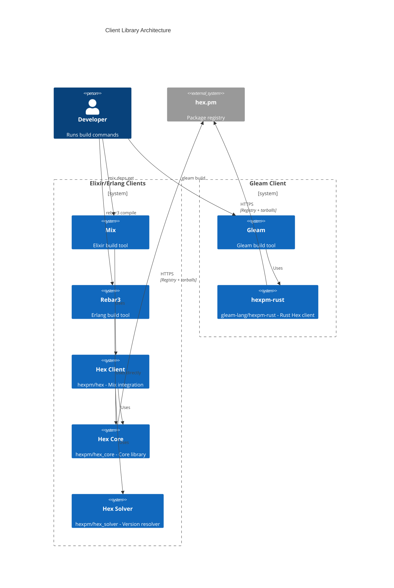

---

## 1. Mix (Elixir) Dependency Installation

Command: `mix deps.get`

### Authentication

Mix/Hex uses OAuth2 Device Authorization Grant ([RFC 8628](https://datatracker.ietf.org/doc/html/rfc8628)) for interactive authentication. OAuth tokens have read-only permissions by default; write operations require 2FA. API keys can still be used directly, especially for CI environments. See [OAuth2 Device Authorization Grant](#6-oauth2-device-authorization-grant) for details.

### Cache Locations

| Cache | Path | Contents |
|-------|------|----------|
| Registry | `~/.hex/cache.ets` | ETS file with package versions, deps, checksums |
| Packages | `~/.hex/packages/hexpm/{package}-{version}.tar` | Downloaded tarballs |
| Config | `~/.hex/hex.config` | OAuth tokens, API keys |
| ETags | Inside `cache.ets` | `{:registry_etag, repo, package}` |

Environment variable `HEX_HOME` overrides the default `~/.hex` location.

### Sequence Diagram

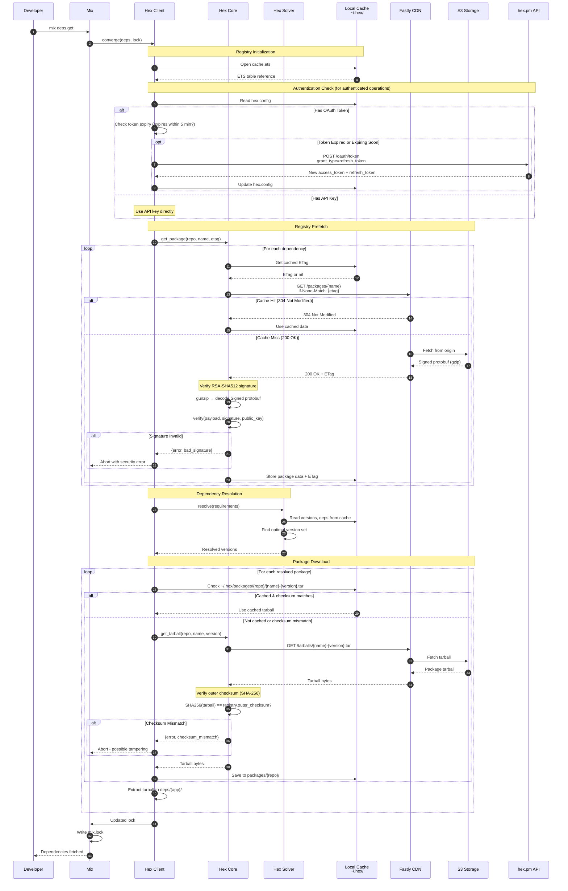

### Error Handling

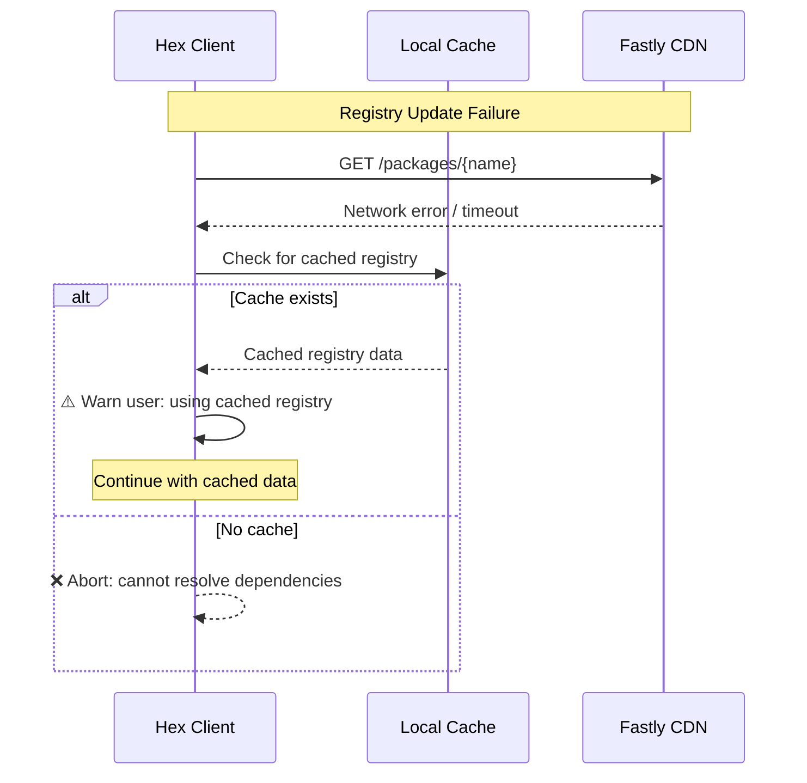

---

## 2. Rebar3 (Erlang) Dependency Installation

Command: `rebar3 compile` (with hex plugin)

### Authentication

Rebar3 uses basic authentication to generate API keys. Unlike Mix/Hex and Gleam, it does not support OAuth2 Device Authorization Grant.

### Cache Locations

| Cache | Path | Contents |
|-------|------|----------|
| Registry | `~/.cache/rebar3/hex/hexpm/registry/` | Registry protobuf files |
| Packages | `~/.cache/rebar3/hex/hexpm/packages/` | Downloaded tarballs |
| Config | `~/.config/rebar3/hex.config` | API keys |
| Lock | `rebar.lock` | Resolved versions with checksums |

### Sequence Diagram

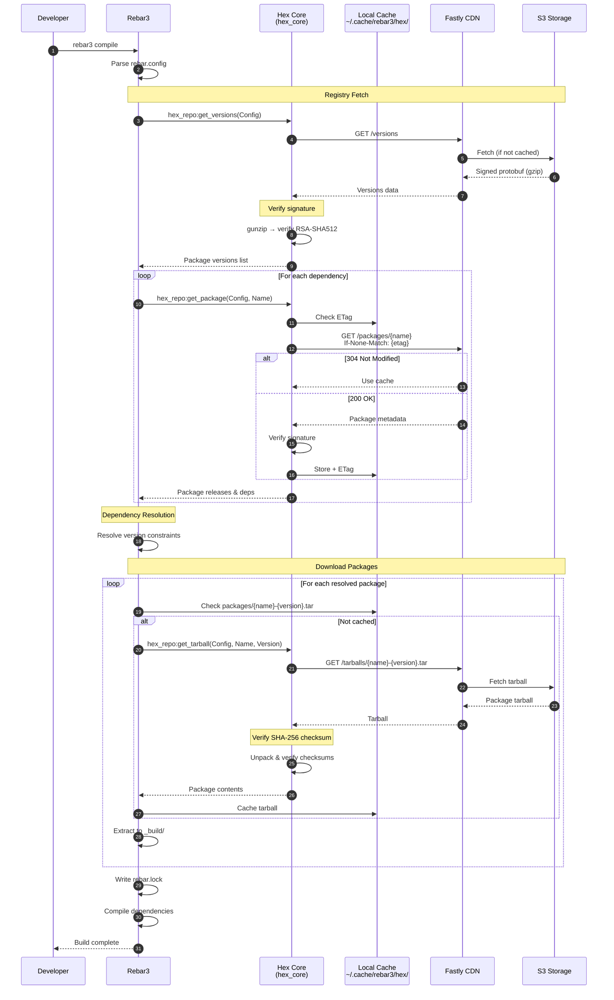

---

## 3. Gleam Dependency Installation

Command: `gleam build`

### Authentication

Gleam uses OAuth2 Device Authorization Grant ([RFC 8628](https://datatracker.ietf.org/doc/html/rfc8628)) for interactive authentication. OAuth tokens have read-only permissions by default; write operations require 2FA. API keys can be used via the `HEXPM_API_KEY` environment variable for CI environments. See [OAuth2 Device Authorization Grant](#6-oauth2-device-authorization-grant) for details.

### Cache Locations

| Cache | Path | Contents |
|-------|------|----------|
| Packages | `~/.cache/gleam/hex/hexpm/packages/` | Downloaded tarballs |
| Credentials | `~/.cache/gleam/hex/hexpm/credentials` | OAuth refresh token (encrypted with user passphrase) |
| Build | `./build/` | Compiled packages |
| Manifest | `manifest.toml` | Resolved versions with checksums |

### Sequence Diagram

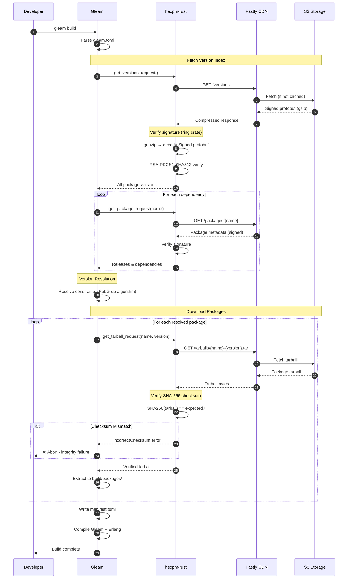

---

## 4. Package Publishing

Command: `mix hex.publish`, `rebar3 hex publish`, or `gleam publish`

### Authentication for Publishing

Publishing requires write permissions:

| Client | Authentication Method | 2FA Requirement |
|--------|----------------------|-----------------|
| Mix/Hex | OAuth token or API key | Required for OAuth tokens |
| Gleam | OAuth token or API key | Required for OAuth tokens |
| Rebar3 | API key (via basic auth) | Not supported |

For OAuth tokens, write operations prompt for a 2FA code which is sent via the `x-hex-otp` header.

### Sequence Diagram

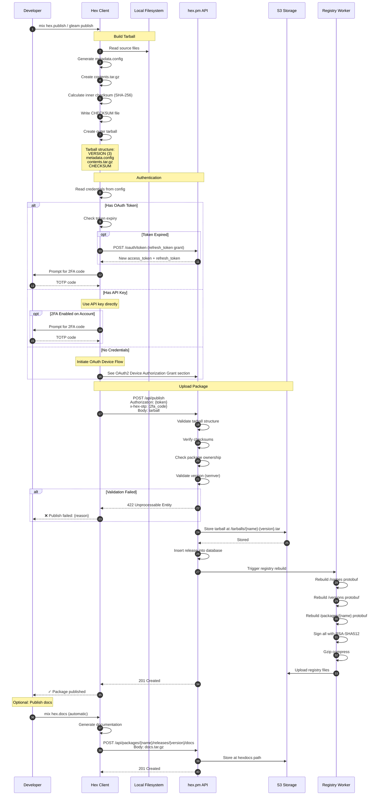

---

## 5. Private Package Flow

For organizations with private packages on hex.pm.

### Endpoints

Private packages use repository-scoped endpoints:

| Endpoint | Description |
|----------|-------------|
| `/repos/{org}/names` | Package names in organization |
| `/repos/{org}/versions` | Package versions in organization |
| `/repos/{org}/packages/{name}` | Package metadata |
| `/repos/{org}/tarballs/{name}-{version}.tar` | Package tarball |

### Sequence Diagram

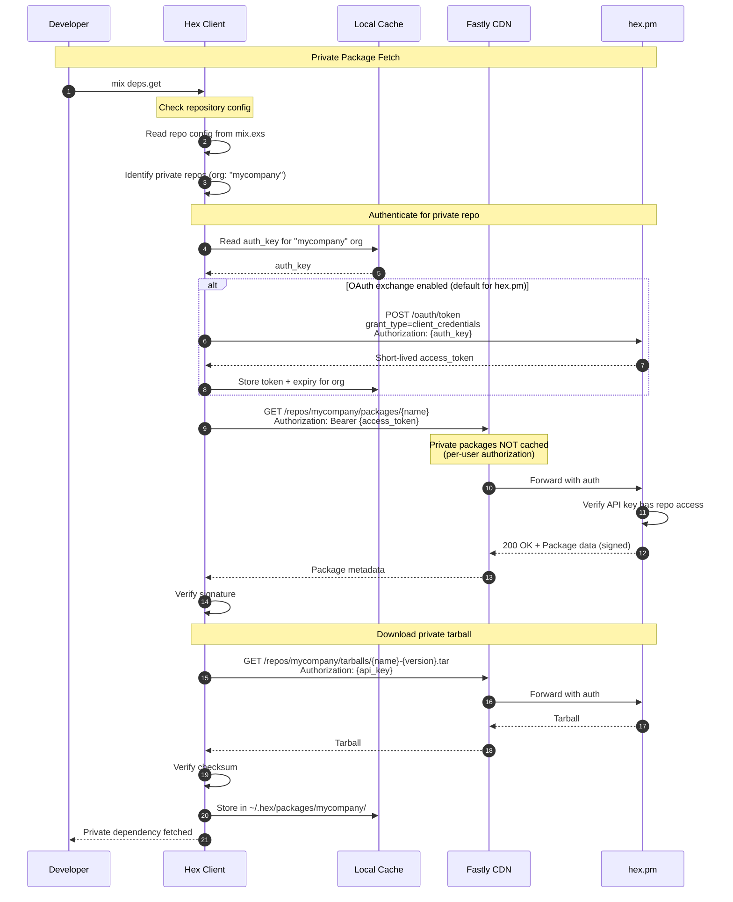

### Security: Untrusted Mirrors

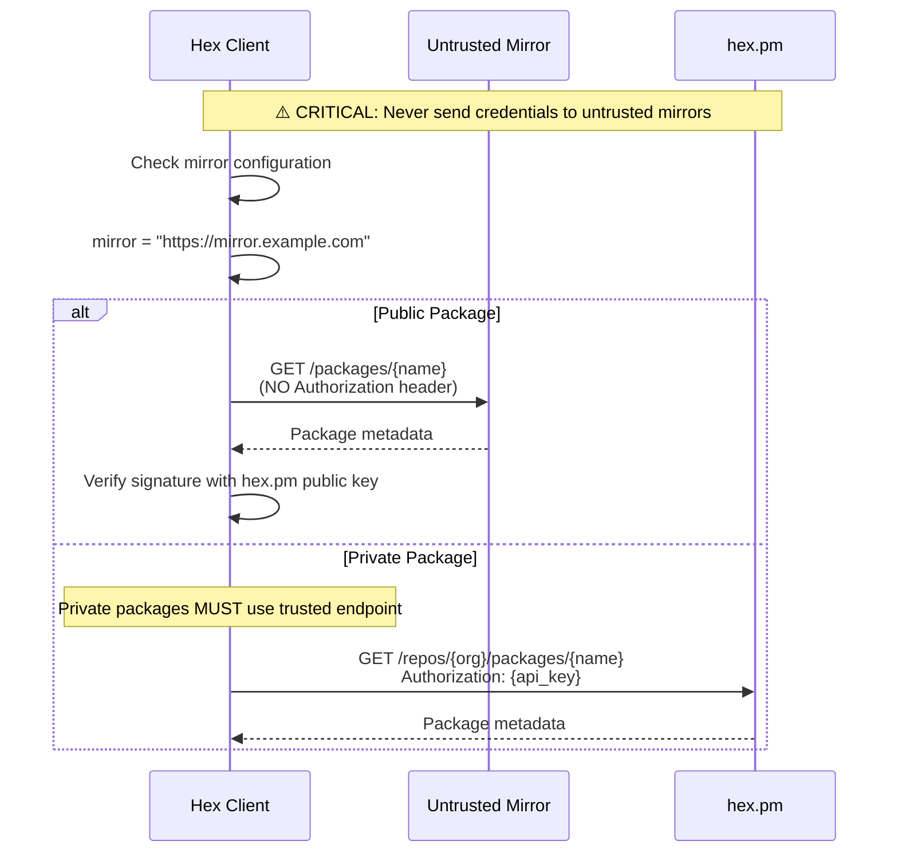

---

## 6. OAuth2 Device Authorization Grant

Mix/Hex and Gleam use [RFC 8628 OAuth2 Device Authorization Grant](https://datatracker.ietf.org/doc/html/rfc8628) for interactive authentication. This flow is designed for CLI tools that cannot easily handle browser redirects.

### Supported Clients

| Client | OAuth Support | Fallback |
|--------|--------------|----------|
| Mix/Hex | Yes (default) | API keys via `HEX_API_KEY` |
| Gleam | Yes (default) | API keys via `HEXPM_API_KEY` |
| Rebar3 | No | Basic auth for API key generation |

### OAuth Endpoints

| Endpoint | Method | Description |
|----------|--------|-------------|
| `/oauth/device_authorization` | POST | Initiate device flow |
| `/oauth/token` | POST | Exchange codes for tokens / refresh tokens |
| `/oauth/revoke` | POST | Revoke tokens |

### Token Properties

| Property | Value |
|----------|-------|
| Access token lifetime | Short-lived (configurable) |
| Refresh token lifetime | Long-lived |
| Default scope | `api` (includes write permissions) |
| Write operations | Require 2FA via `x-hex-otp` header |

### Sequence Diagram

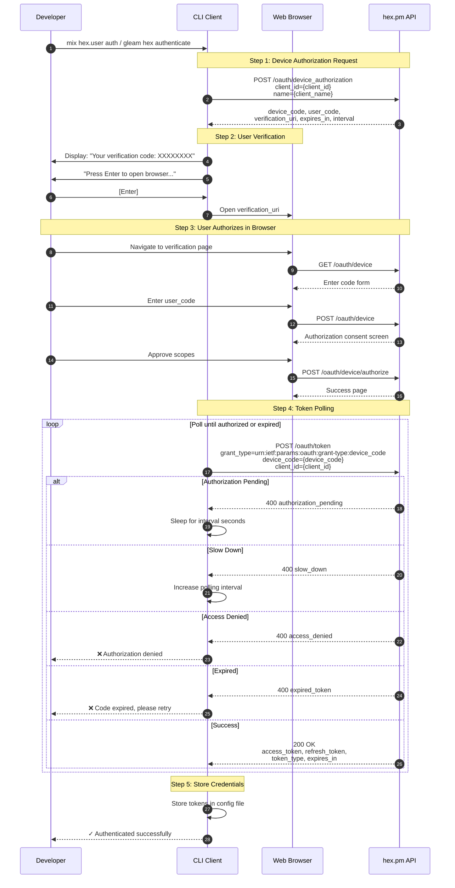

### Token Refresh Flow

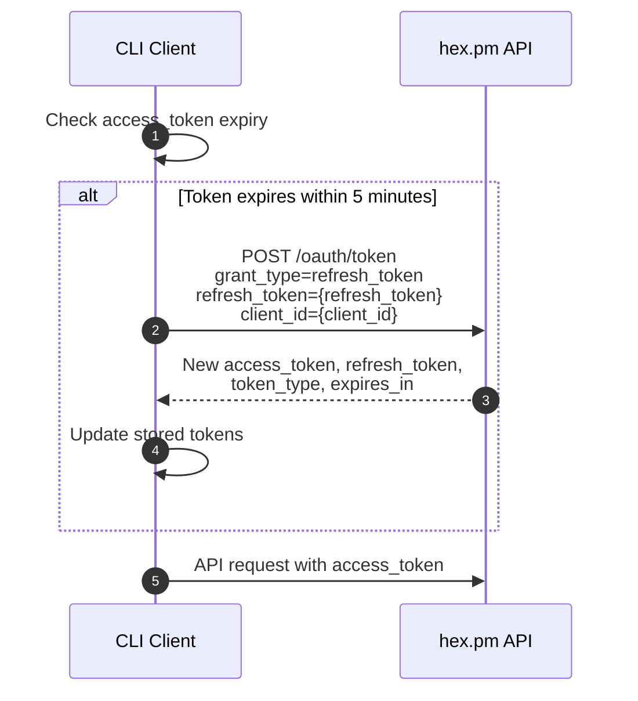

### Write Operations with 2FA

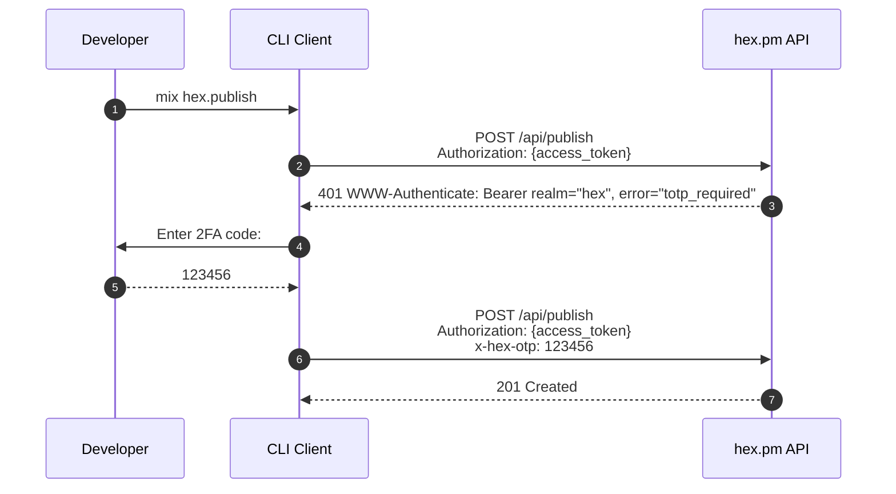

### Client-Specific Details

#### Mix/Hex

- Client ID: `78ea6566-89fd-481e-a1d6-7d9d78eacca8`
- Token storage: `~/.hex/hex.config`
- Commands: `mix hex.user auth`, `mix hex.user deauth`

#### Gleam

- Client ID: `877731e8-cb88-45e1-9b84-9214de7da421`
- Token storage: `~/.cache/gleam/hex/hexpm/credentials` (refresh token encrypted with user passphrase)
- Command: `gleam hex authenticate`

---

## Verification Summary

All clients perform these verification steps:

### Registry Verification

1. **Decompress** - gunzip the response
2. **Decode** - Parse `Signed` protobuf wrapper
3. **Verify Signature** - RSA-PKCS1-SHA512 of payload using hex.pm public key
4. **Verify Repository** - Ensure `repository` field matches expected repo name
5. **Parse Payload** - Decode inner protobuf (Names, Versions, or Package)

### Tarball Verification

1. **Download** - Fetch tarball from `/tarballs/{name}-{version}.tar`
2. **Outer Checksum** - `SHA256(entire tarball)` must match registry's `outer_checksum`
3. **Extract** - Unpack tar to get VERSION, metadata.config, contents.tar.gz, CHECKSUM
4. **Inner Checksum** - Verify CHECKSUM file matches `SHA256(VERSION + metadata.config + contents.tar.gz)`

### Public Key

The hex.pm public key is:
- Distributed with client libraries (hardcoded)
- Available at `https://hex.pm/docs/public_keys`
- 2048-bit RSA key used for RSA-PKCS1-SHA512 signatures
